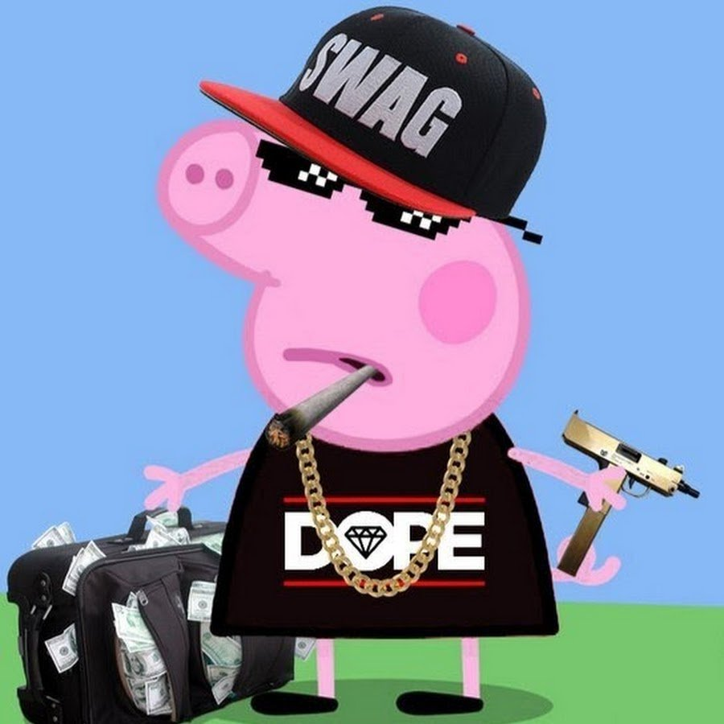

# Github Laboratory
## Description

Github introduction hw
Mariano

## Contents

### Images
Best image ever


### Code examples
```python
a = 1
b = 2
a + b
```

### Lists
- [ ] Turn on GitHub Pages
- [ ] Outline my portfolio
- [x] Introduce myself to the world


## References

[Github Documentation](https://docs.github.com/en)

[Github Glossary](https://docs.github.com/en/get-started/learning-about-github/github-glossary)

[Git documentation](https://docs.github.com/en](https://git-scm.com/doc
)


